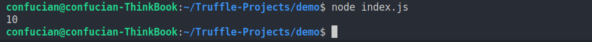

# 使用Web3.js调用智能合约示例

## 说明

本文会演示如何在本地编译部署智能合约，使用 `web3.js` 连接你的合约，并调用合约中的函数。

> 注：笔者所使用的操作系统为 Ubuntu22.04 

### 所需工具

- Node.js
- Truffle
- Ganache
- Web3.js
- VS Code

## 开始

> Node.js 和 VS Code 笔者就默认已装，不在这里讲述如何安装了

### 安装Truffle

```shell
npm install -g truffle
```

### 创建Truffle项目

首先创建一个文件夹作为你的项目目录（这里我命名为demo）

使用 VS Code 打开该文件夹，新建终端

初始化 Truffle 项目


随后你可以看到文件目录如下：


简单介绍下这些文件和文件夹：

- contracts 文件夹下存放合约文件
- migrations 文件夹下存放合约迁移脚本
- test 文件夹下存放测试代码文件
- truffle-config.js 用来配置 truffle 项目

### 编写智能合约

> contracts 文件夹下的 Migration.sol 是 truffle 自动生成的，可以忽略

在 `contracts` 文件夹下新建 `MyContract.sol` ，内容如下：

```solidity
// SPDX-License-Identifier: MIT
pragma solidity ^0.8.0;

contract MyContract {
    uint data;

    function getData() external view returns (uint) {
        return data;
    }

    function setData(uint _data) external {
        data = _data;
    }
}
```

### 编写迁移脚本

> migrations 文件夹下的 1_initial_migration.js 是 truffle 自动生成的，可以忽略

在 `migrations` 文件夹下新建 `2_deploy_migration.js` ，内容如下：

```js
const MyContract = artifacts.require("MyContract");

module.exports = function (deployer) {
  deployer.deploy(MyContract);
};
```

### 配置truffle-config.js

移除 truffle-config.js 中 `networks` 里的 `development` 注释，并修改端口为 7545 (Ganache所用端口)


### 编译合约

首先本地启动 Ganache


然后使用 Truffle 命令编译合约


这时你可以看到在项目目录下多了一个 build 文件夹，里面存放合约编译后的文件

### 安装web3.js

```shell
npm install web3
```

### 使用web3.js连接合约

项目目录(demo)下新建 index.js 文件内容如下：

```js
const Web3 = require('web3');
const MyContract = require('./build/contracts/MyContract.json');

const init = async () => {
    const web3 = new Web3('http://localhost:7545');

    const id = await web3.eth.net.getId();
    const deployedNetwork = MyContract.networks[id];
    const contract = new web3.eth.Contract(
        MyContract.abi,
        deployedNetwork.address
    );

    const data = await contract.methods.getData().call();
    console.log(data);
    
}

init();
```

代码中实现了 `getData()` 函数的调用

迁移部署合约到本地


可以看到我们编写的迁移被执行，合约被部署到了本地的 Ganache 上，查看 Ganache 发现区块增加以及具体的 transcations

执行 index.js 来调用 `MyContract` 合约中的 `getData()` 


因为我们之前没有设置 `data` 的值，所以查到 `data` 为 0

现在我们修改 index.js 的代码来调用 `setData()` 函数进而修改合约中 `data` 的值

```js
const Web3 = require('web3');
const MyContract = require('./build/contracts/MyContract.json');

const init = async () => {
    const web3 = new Web3('http://localhost:7545');

    const id = await web3.eth.net.getId();
    const deployedNetwork = MyContract.networks[id];
    const contract = new web3.eth.Contract(
        MyContract.abi,
        deployedNetwork.address
    );

    const addresses = await web3.eth.getAccounts();
    await contract.methods.setData(10).send({
        from: addresses[0],
    });

    const data = await contract.methods.getData().call();
    console.log(data);
    
}

init();
```

同样执行 index.js



可以看到合约中的 `data` 成功被修改为输入的参数 10

查看 Ganache 可以看到我们调用 `setData()` 的交易

## 小结

以上就是简单地使用 web3.js 连接智能合约并调用合约中方法的演示